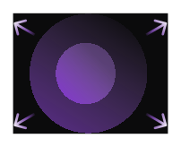
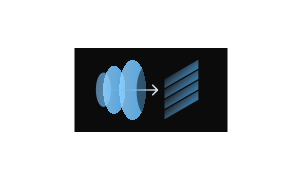
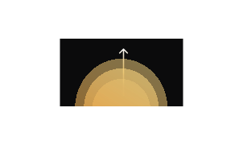

[Introducing nova-3 with significant transcription improvements! →](/docs/models-languages-overview)

<h1>Welcome to Deepgram Docs!</h1>
Empower your products with out Voice AI APIs.

Use them separately or combine them to **easily build low latency and realistic** Voice AI solutions!

  

    <h3>Voice agent API</h3>
    

      Create agents for contact centers, teaching, drive thrus and more
    

    
    - [Getting started](/docs/getting-started-with-voice-agent-api)
    - [Function calling](/reference/voice-agent-api)
  

  
  

    
  

<CardGroup cols={3}>
  <Card>
    
  
    <h3>Speech to text API</h3>
    

      Transcribe audio for contact centers, medical audio, wearables and more
    

    
    - [Pre-recorded](/docs/getting-started-with-speech-to-text)
    - [Streaming](/docs/getting-started-with-speech-to-text#streaming)
    - [Models and Languages](/docs/getting-started-with-speech-to-text#models-and-languages)
  </Card>
  <Card>
    
  
    <h3>Text to speech API</h3>
    

      Generate audio for contact centers, IVRs, drive thrus and more
    

    
    - [Getting started](/docs/getting-started-with-speech-to-text)
    - [Voices](/docs/getting-started-with-speech-to-text#streaming)
  </Card>
  <Card>
    
  
    <h3>Intelligence API</h3>
    

      Gain insights for phone calls and transcripts
    

    
    - [Audio inputs](/docs/getting-started-with-intelligence-api)
    - [Text inputs](/docs/getting-started-with-intelligence-api)
  </Card>
</CardGroup>

## SDKs
<CardGroup cols={4}>
<Card 
  title="Python"
  iconPosition="left"
  icon={}
/>
<Card 
  title="JavaScript"
  iconPosition="left"
  icon={}
/>
<Card 
  title=".Net"
  iconPosition="left"
  icon={}
/>
<Card 
  title="Go"
  iconPosition="left"
  icon={}
/>
</CardGroup>

## Resources

<CardGroup cols={3}>
<Card 
  title="Explore"
  icon="rocket"
  iconPosition="left"
>
- [API Playground](/)
- [API Reference](/)
</Card>
<Card 
  title="Self Host"
  icon="tools"
  iconPosition="left"
>
- [Get started with self-hosting](/)
- [Self-hosted add-ons](/)
</Card>
<Card 
  title="Community"
  icon="users"
  iconPosition="left"
>
- [Discord](/)
- [Discussion Forums](/)
</Card>
</CardGroup>

