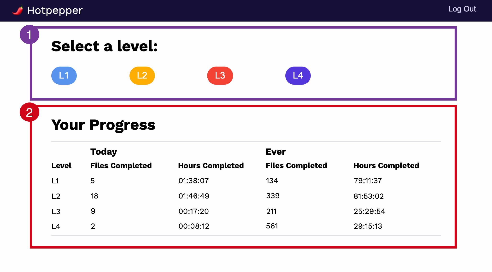

Deprecated

When users log into Hotpepper, they are presented with the Hotpepper user dashboard.

## Selecting Files

Deepgram best practices require that all audio files be reviewed by four independent users. Hotpepper implements the idea of independent reviewers through the concept of levels, each of which represents a queue of unlabeled files that require different levels of effort. To learn more about Deepgram’s suggested ordering of operations, visit [Hotpepper User Guide: Understanding the Workflow](/on-prem/optional-components/hotpepper/understanding-workflow/).

To select a file:

Select the level that corresponds to the desired review level. The system will automatically assign you a file from the selected queue and take you to the labeling view for the assigned file.

<Info>
While reviewing, you can pause your work before completion. If you have previously paused a file at the selected level, the system will automatically load the paused file into the labeling view, so you can finish your work.
</Info>

<Info>
Once you have finished labeling a file and marked it as done, the file is added to the queue for the next labeling level, and you will no longer be able to see it.
</Info>

## Reviewing Progress

Hotpepper allows users to track their progress at each labeling level.

### Today

Users can track their progress for the past 24 hours, including:

- Number of files completed
- Number of hours worked

### Ever

Users can track all of their progress ever, including:

- Number of files completed
- Number of hours worked
